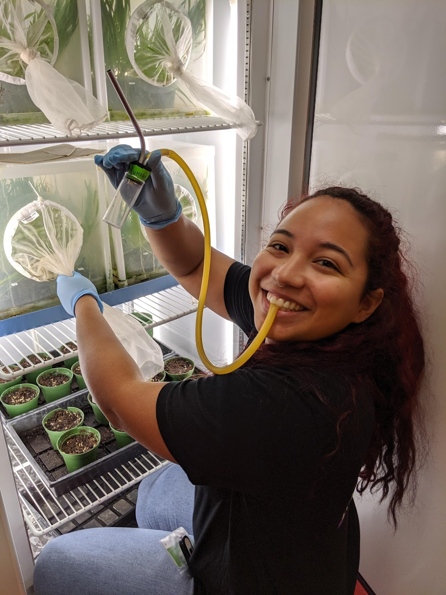
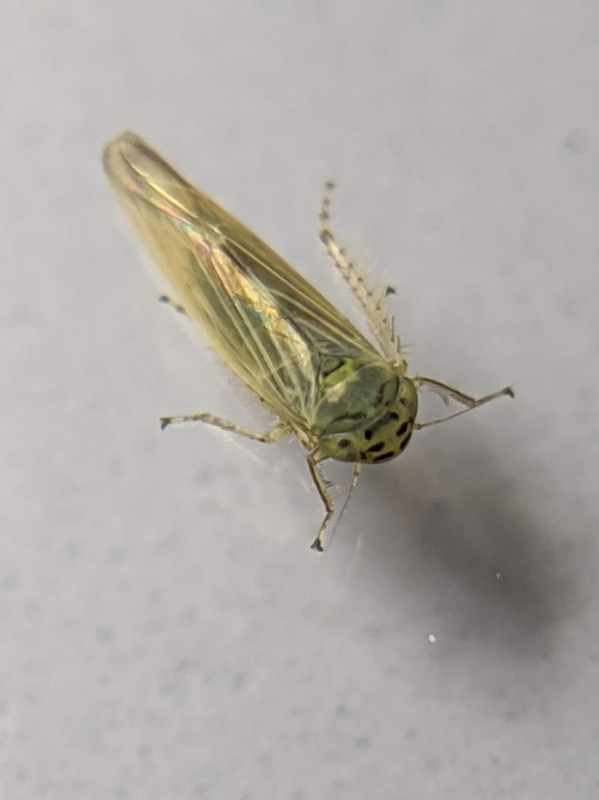

 My research interest includes using comparative genomics to study the co-evolution of obligate symbionts and their hosts.  

 I am currently studying the co-evolution of the symbionts _Candidatus_ Sulcia muelleri and _Candidatus_ Nasuia deltocephalinicola with their leafhopper hosts. My current research focuses on leafhoppers that are endemic to the Hawaiian Archipelago. However, my future research will include using the _Macrosteles quadrilineatus_ leafhopper.

-Image of  _Macrosteles quadrilineatus_ leafhopper